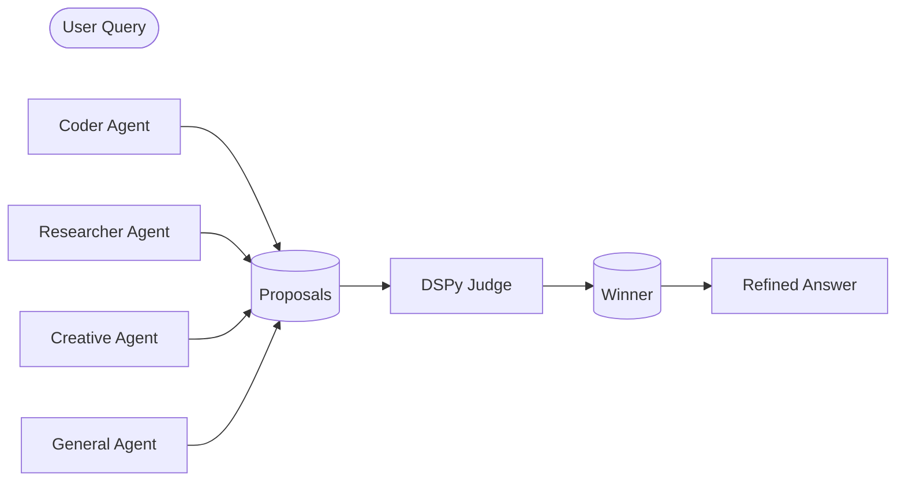

# Hermes Agent Panel

**Ask once. Let 3-9 agents answer. Pick the best.**

Multi-agent orchestration powered by DSPy — parallel proposals → Stanford DSPy judge → the answer that actually wins.

<p align="center">

[](https://python.org)
[](https://github.com/stanfordnlp/dspy)
[](#license)
[](#agents)

</p>

---

## How it works



Three lines of code:

```python
from agent_panel import AgentPanel

result = AgentPanel().run(
    query="Best auth strategy for FastAPI?",
    agent_types=["coder", "devops", "general"]
)

print(result.winner_agent)   # which agent won
print(result.best_answer)   # the actual answer
```

---

## Install

```bash
pip install dspy anthropic openai
```

```bash
git clone https://github.com/DevvGwardo/hermes-agent-panel.git
cd hermes-agent-panel
pip install -r requirements.txt
```

Set your API keys:

```bash
export ANTHROPIC_API_KEY="sk-ant-..."
export OPENAI_API_KEY="sk-..."
```

---

## Quick start

```bash
# Ask the panel
python main.py "Best way to handle authentication in FastAPI?"

# Specify agents
python main.py "Explain quantum computing" -a general creative researcher

# List all agents
python main.py --list-agents
```

---

## Agents

| Agent | Provider | Best for |
|---|---|---|
| `coder` | Anthropic | Code, architecture, debugging |
| `researcher` | Anthropic | Deep facts, analysis, citations |
| `creative` | OpenAI | Brainstorming, novel ideas |
| `devops` | Anthropic | Infrastructure, scaling, CI/CD |
| `general` | Anthropic | Balanced, broad knowledge |
| `claude` | Anthropic | Strong reasoning, nuance |
| `openai` | OpenAI | Broad knowledge, creativity |
| `hermes` | MiniMax | Fast, efficient |
| `grok` | xAI | Witty, direct |

---

## The judge improves with feedback

```python
# Record when the judge gets it wrong
panel.feedback(
    query="Your question",
    proposals=result.proposals,
    chosen_agent="claude",   # which you actually preferred
    score=5
)

# Tune the judge after 5+ interactions
python main.py --optimize
# or
panel.optimize_judge()
```

MIPRO (Multi-Stage Prompt Optimization) from Stanford DSPy learns which agent types win on which query types — your panel gets sharper over time.

---

## Configuration

```python
panel = AgentPanel(
    judge_model="claude-sonnet-4-5-20250929",
    judge_provider="anthropic",
    max_parallel=5,
    timeout_per_agent=120,
    min_proposals=2,
    use_refinement=True,   # refine the winning answer
    enable_cot=True,        # Chain-of-Thought in judge
)
```

---

## As a Hermes skill

```bash
cp -r hermes-agent-panel ~/.hermes/skills/agent-panel
```

Then ask naturally:

- *"Ask all agents: best way to shard a Postgres database?"*
- *"Run a panel on: FastAPI vs Flask for a high-traffic API"*
- *"Which agent would be best for debugging this race condition?"*

---

## Project structure

```
hermes-agent-panel/
agent_panel/
  core.py      # AgentPanel, DSPyJudge, PanelResult
  agents.py    # 9 built-in agents + BaseAgent
  prompts.py   # DSPy signatures
main.py        # CLI entry point
tests/         # 23 tests
SKILL.md       # Hermes skill definition
```

---

<p align="center">

[](https://github.com/DevvGwardo/hermes-agent-panel)

</p>
